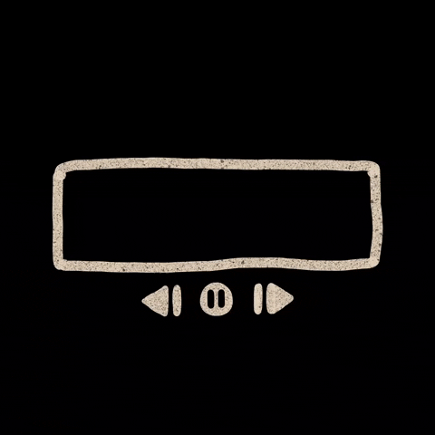

<!-- PROJECT LOGO -->
 

  

<h3 align="center">Music Thru the Ages</h3>

  

    A data analytics project that aims to find the shifting trends in music!
     
     
    <a href="https://share.streamlit.io/zhishan03/music-taste-analysis/main.py">View Demo</a>
    ·
    <a href="https://github.com/zhishan03/Music-Taste-Analysis/issues">Report Bug</a>
    ·
    <a href="https://github.com/zhishan03/Music-Taste-Analysis/issues">Request Feature</a>
  

<!-- TABLE OF CONTENTS -->

  
Table of Contents

  <ol>
    <li>
      <a href="#about-the-project">About The Project</a>
      <ul>
        <li><a href="#built-with">Built With</a></li>
      </ul>
    </li>
    <li><a href="#roadmap">Result</a></li>
  </ol>

<!-- ABOUT THE PROJECT -->
## About The Project

Did people's music taste change over the last 4 decades, if so, in what ways? Curious as to what the answers are, I started brainstorming ideas and began working on this project. 

Using BeautifulSoup, I scraped [Billboard Hot 100 on Wikipedia](https://en.wikipedia.org/wiki/Billboard_Hot_100) from 1980 up to 2020. After compiling the data into excel, I was then able to extract these songs' audio features (Danceability, Acousticness, Duration, Tempo...) from Spotify API. Following that, I did data exploration and K-means clustering to divide the songs into 4 categories. All of these was then productionized to an interactive Streamlit app!

 

## Clusters:
#### Happy Dance
This cluster comprises low-acousticness songs with high danceability and energy, as well as, this is the group with highest level of musical positiveness. 

Ex: 
* "Hey Look Ma, I Made It" by Panic!at the Disco
* "Adore You" by Harry Styles
* "All I Want for Christmas Is You" by Mariah Carey
______________
#### Neutral Dance
This cluster is the highest in danceability but it contains songs with higher acousticness and a little lower energy 

Ex:
* "Dance Monkey" by Tones and I
* "Dynamite" by BTS
* "Señorita" by Shawn Mendes and Camila Cabello
______________
#### Depressed Dance
Despite here the danceability and energy is moderated, this has the lowest level of acousticness and musical positivity. 

Ex: 
* "Blinding Lights" by The Weeknd 
* "Circles"	by Post Malone
* "Thank U, Next" by Ariana Grande
______________
#### Acoustic Melody
This cluster contains the songs with highest level of acousticness in average, with a low level of energy and danceability. 

Ex: 
* "Night Changes" by One Direction
* "Let It Go" by James Bay
* "Lost Boy" by Ruth B

(<a href="#top">back to top</a>)

### Built With

* BeatifulSoup
* Sklearn
* Seaborn
* Matplotlib
* Pandas
* Plotly.Express
* Streamlit

(<a href="#top">back to top</a>)

<!-- ROADMAP -->
## Result

The evident result is people's loss of interest in acoustic songs. It is shown that ~22% of the Billboard Hot 100 number-one singles of 1980 are acoustic songs, whereas that statistics has reduced significantly down to ~10% in 2020. 

The only type of music that is on an upward climb is 'Neutral Dance', or songs that are upbeat and contains a hint of acousticness but don't convey a strong positive or negative emotion (Ex: "Dynamite" by BTS, "Señorita" by Shawn Mendes and Camila Cabello). It went up from ~25% in 1980 to ~44% in 2020.

People definitely favors upbeat and slightly acoustic songs over any other kind!

(<a href="#top">back to top</a>)

<!-- MARKDOWN LINKS & IMAGES -->
<!-- https://www.markdownguide.org/basic-syntax/#reference-style-links -->
[contributors-shield]: https://img.shields.io/github/contributors/github_username/repo_name.svg?style=for-the-badge
[contributors-url]: https://github.com/github_username/repo_name/graphs/contributors
[forks-shield]: https://img.shields.io/github/forks/github_username/repo_name.svg?style=for-the-badge
[forks-url]: https://github.com/github_username/repo_name/network/members
[stars-shield]: https://img.shields.io/github/stars/github_username/repo_name.svg?style=for-the-badge
[stars-url]: https://github.com/github_username/repo_name/stargazers
[issues-shield]: https://img.shields.io/github/issues/github_username/repo_name.svg?style=for-the-badge
[issues-url]: https://github.com/github_username/repo_name/issues
[license-shield]: https://img.shields.io/github/license/github_username/repo_name.svg?style=for-the-badge
[license-url]: https://github.com/github_username/repo_name/blob/master/LICENSE.txt
[linkedin-shield]: https://img.shields.io/badge/-LinkedIn-black.svg?style=for-the-badge&logo=linkedin&colorB=555
[linkedin-url]: https://linkedin.com/in/linkedin_username
[product-screenshot]: images/screenshot.png

